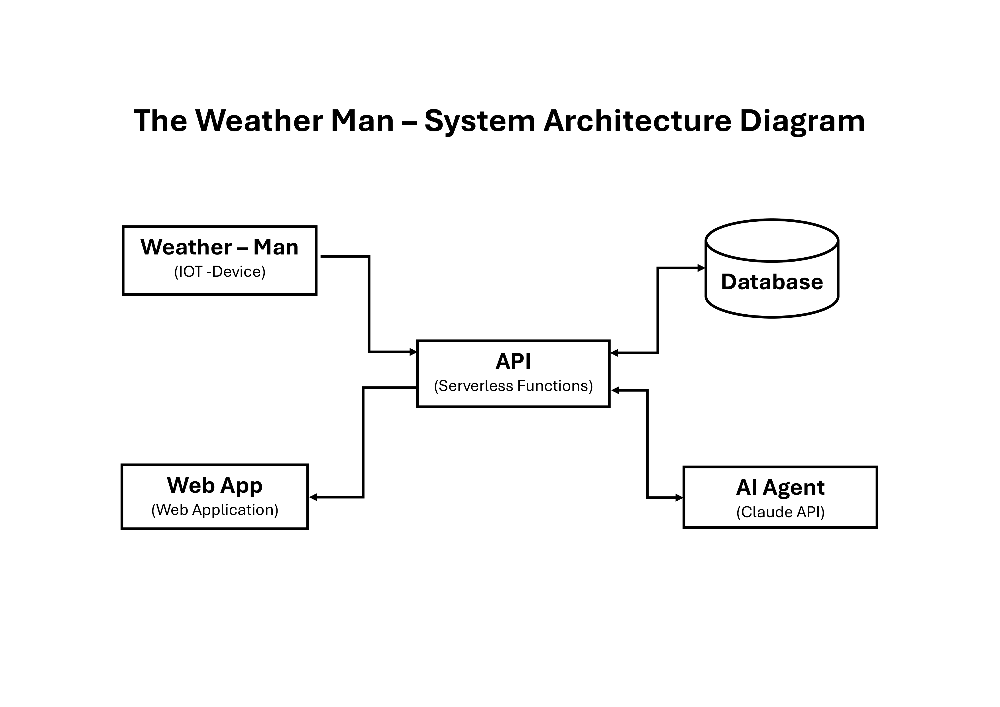
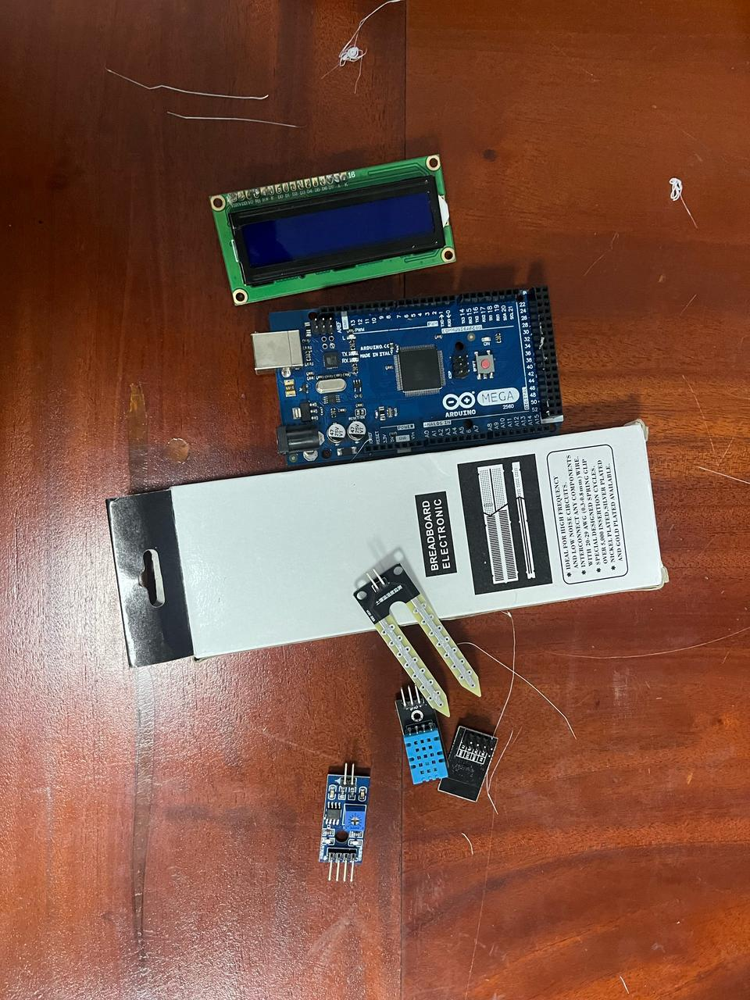
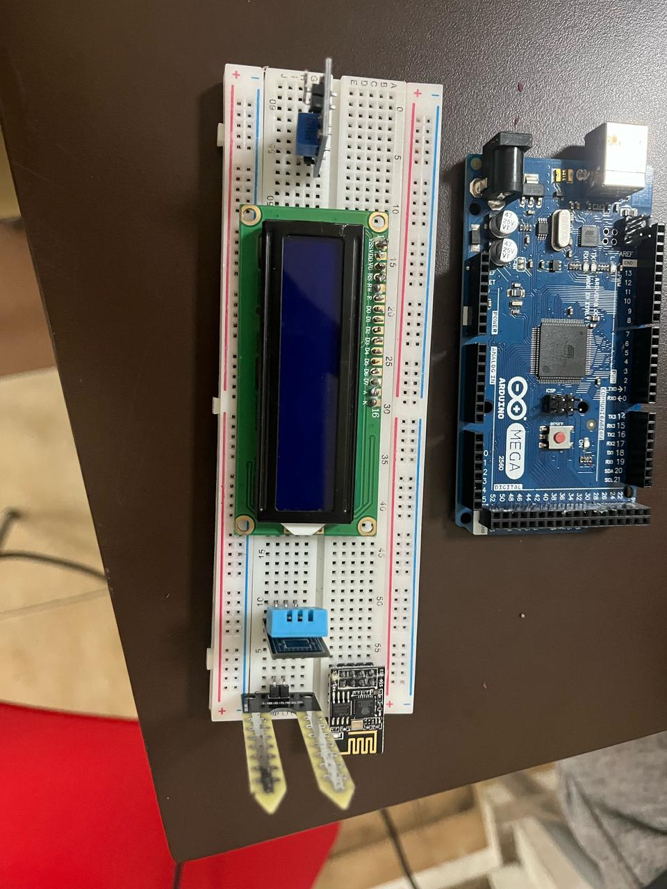
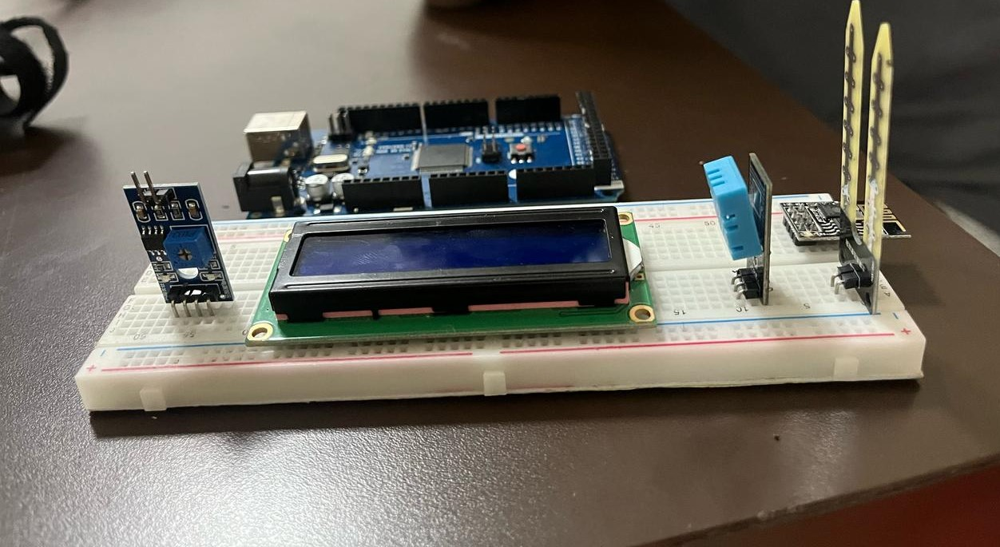
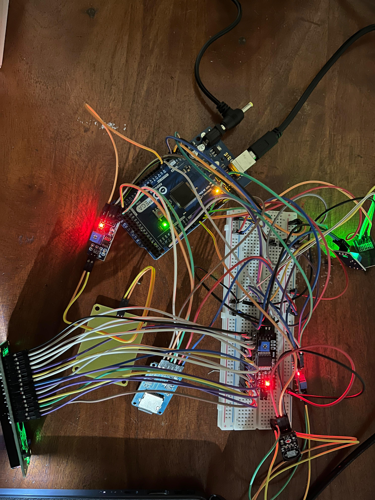
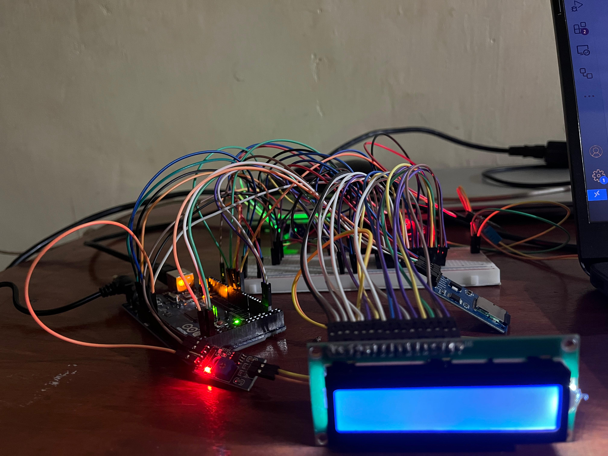

## The Weather Man – IoT-Based Smart Weather Monitoring System

Figure 1: Weather Man System Overview

---

### Description

**The Weather Man** is an IoT-based smart weather monitoring system that collects, processes, and displays real-time environmental data. It uses a suite of sensors to measure temperature, humidity, soil moisture, and rainfall, transmitting data to a cloud platform for storage and analysis. The system features a web application for remote monitoring and is designed for future AI integration to provide advanced insights. Its modular hardware and software architecture make it ideal for educational, agricultural, and research applications.

---

### Team Members (Ordered by ascending Student IDs)

| Name        | Student ID |
| ----------- | ---------- |
| Afra        | S/21/005   |
| Hana        | S/21/063   |
| Mundhira    | S/21/102   |
| Anshaf      | S/21/315   |
| Arani       | S/21/317   |
| Danshika    | S/21/340   |
| Premasalini | S/21/466   |
| Romesh      | S/21/489   |
| Shahama     | S/21/490   |
| Sivothayan  | S/21/513   |

---

### Current Progress

#### PS: If you want to see the progress as of April 30, 2025, please check the [As of April 30, 2025 GitHub Repo](https://github.com/Sivothajan/weather-man/tree/31057a6575f7ccb06b0e44e5aa5a5fb1c9c69691)

#### 🔧 Hardware Setup

| Component                       | Description                     | Availability          |
| ------------------------------- | ------------------------------- | --------------------- |
| Arduino Mega 2560               | Main controller                 | Available             |
| Capacitive Soil Moisture Sensor | Measures soil moisture          | Available             |
| AC to DC Converter              | Power supply                    | Available             |
| Breadboard                      | For prototyping circuits        | Available             |
| SD Card Module                  | Logging weather data            | Available             |
| Raindrop Sensor Plate           | Detects rainfall                | Available             |
| Jumper Wires                    | For circuit connections         | Available             |
| DHT11                           | Temperature and Humidity sensor | Available (Defective) |
| LCD Display (16x2)              | Displays weather data           | Available (Defective) |
| ESP8266 (ESP-01)                | Wi-Fi communication             | Available (Defective) |
| Weather Station Production Case | Enclosure for all components    | Pending               |

> **Note:**
>
> - **Available**: Component is on hand
> - **Available (Defective)**: Component is on hand but not functional (component is defective)
> - **Pending**: Component has been ordered and is awaiting delivery or installation/ assembly

---

#### 🧠 Software Progress

- Basic sensor reading code: **Completed**
- Cloud data transmission via API: **Completed**
- Database integration: **Completed**
- Web app integration: **Completed**
- AI integration (Claude API): **Completed**
- SD card data logging: **Completed**

| Feature                     | Status         | Notes                                        |
| --------------------------- | -------------- | -------------------------------------------- |
| Sensor Reading              | Completed      | All sensors tested and operational           |
| API Data Transmission       | Completed      | All APIs tested and operational              |
| Database Integration        | Completed      | Database set up and tested                   |
| Web App Integration         | Completed      | Web app tested and operational               |
| AI Integration (Claude API) | Completed      | AI integration tested and operational        |
| SD Card Data Logging        | Completed      | SD Card Datab Logging tested and operational |
| Documentation               | In Final Stage | User manual and technical documentation      |

---

### 📂 Explore the Codebase

You can browse the project source code in the following directories:

- [API Backend](./codebase/cloud-api/) – Handles data processing and cloud integration.
- [IoT Firmware](./codebase/iot-firmware/) – Microcontroller and sensor code.
- [Web Application](./codebase/web-app/) – User interface for monitoring and analytics.

[**View Full Codebase on GitHub**](./codebase/)

---

### 📸 Project Gallery

#### Components Overview

|             Scratch              |              Top View              |              Side View               |
| :------------------------------: | :--------------------------------: | :----------------------------------: |
|  |  |  |

#### Testing the Components (Overview)

|                  Top View                  |                  Side View                   |
| :----------------------------------------: | :------------------------------------------: |
|  |  |
