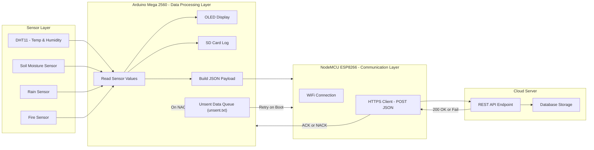
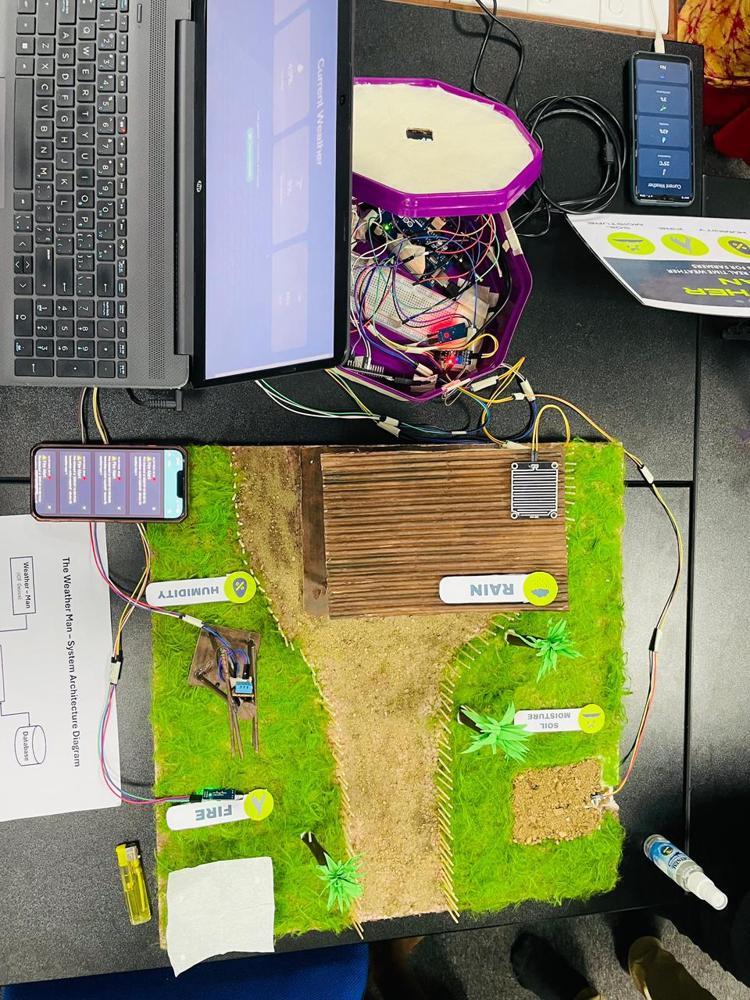

# 🌦️ The Weather Man – IoT-Based Smart Weather Monitoring System


**Figure 1:** Weather Man System Overview

---

## 🧩 Description

**The Weather Man** is an IoT-based smart weather monitoring system designed to collect, process, and visualize environmental data in real time.
It is available in two primary hardware implementations:

1. **NodeMCU V3 Module** – compact, all-in-one WiFi solution
2. **Arduino Mega 2560 Module** – robust version with OLED display and SD card logging

Both systems support the following features:

- Temperature and humidity (DHT11)
- Soil moisture (capacitive sensor)
- Rainfall detection
- Fire detection
- Real-time visualization
- Cloud API integration

### 💡 Use Cases

- **Educational:** Learn IoT, sensors, and data logging
- **Agricultural:** Soil and environment monitoring
- **Research:** Long-term weather data collection

---

## 🏗️ System Architecture



---

## ⚙️ Technical Specifications

### 🧱 NodeMCU V3 Implementation

- **Controller:** ESP8266 (WiFi-enabled)
- **Storage:** SPIFFS file system
- **Power:** 3.3V logic (USB powered)
- **Cycle:** 10 seconds
- **Data Format:** JSON via HTTP POST

### 🧰 Arduino Mega 2560 Implementation

- **Controller:** ATmega2560 + ESP8266 WiFi
- **Display:** OLED 128x64 (I2C)
- **Storage:** SD card
- **Power:** 5V logic (12V input)
- **Cycle:** 10 seconds
- **Data Format:** JSON via HTTP POST

---

## 🔧 Hardware Setup

### NodeMCU V3 Components

| Component             | Description            | Purpose                   |
| --------------------- | ---------------------- | ------------------------- |
| NodeMCU V3 (ESP8266)  | Controller + WiFi      | Processing & connectivity |
| DHT11 Sensor          | Temperature & Humidity | Environmental monitoring  |
| Soil Moisture Sensor  | Analog type            | Soil condition monitoring |
| Rain Sensor (Analog)  | Analog output          | Rainfall detection        |
| Fire Sensor/Module    | Digital output         | Fire/Flame detection      |
| USB Power Supply (5V) | Via USB or external    | Power delivery            |

#### Pin Configuration (NodeMCU)

| Component     | Pin | GPIO   | Type    | Description                 |
| ------------- | --- | ------ | ------- | --------------------------- |
| DHT11         | D2  | GPIO4  | Digital | Temperature & Humidity Data |
| Soil Moisture | A0  | ADC    | Analog  | Soil Moisture Reading       |
| Rain Sensor   | D5  | GPIO14 | Digital | Rain Detection              |
| Fire Sensor   | D6  | GPIO12 | Digital | Fire Detection              |

---

### Arduino Mega 2560 Components

| Component             | Description            | Purpose                   |
| --------------------- | ---------------------- | ------------------------- |
| Arduino Mega 2560     | Main controller        | Core processing           |
| NodeMCU V3 (ESP8266)  | WiFi module            | Wireless connectivity     |
| DHT11 Sensor          | Temperature & humidity | Environmental monitoring  |
| Soil Moisture Sensor  | Analog type            | Soil condition monitoring |
| Rain Sensor           | Analog output          | Rainfall detection        |
| Fire Sensor/Module    | Digital output         | Fire/Flame detection      |
| OLED Display (128x64) | I2C interface          | Data visualization        |
| SD Card Module        | SPI interface          | Data logging              |
| Power Supply (12V)    | External adapter       | System power              |

#### Pin Configuration (Mega 2560)

| Component     | Arduino Pin | Type    | Description                 |
| ------------- | ----------- | ------- | --------------------------- |
| DHT11         | 2           | Digital | Temperature & Humidity Data |
| ESP8266 RX    | 3           | Digital | WiFi Module Serial RX       |
| ESP8266 TX    | 4           | Digital | WiFi Module Serial TX       |
| Fire Sensor   | 6           | Digital | Fire Detection              |
| SD Card CS    | 10          | Digital | SD Card Chip Select         |
| SD Card MOSI  | 51          | Digital | SPI MOSI                    |
| SD Card MISO  | 50          | Digital | SPI MISO                    |
| SD Card SCK   | 52          | Digital | SPI Clock                   |
| OLED SDA      | 20          | Digital | I2C Data                    |
| OLED SCL      | 21          | Digital | I2C Clock                   |
| Soil Moisture | A0          | Analog  | Soil Moisture Reading       |
| Rain Sensor   | A1          | Analog  | Rain Detection              |

---

## 🧠 Software Implementation

### Operation Sequence

1. **Initialization**
   - Serial & WiFi setup
   - DHT & OLED initialization
   - SD card mount
   - WiFi connection check

2. **Main Loop (10s cycle)**
   - Sensor data collection
   - Data conversion and logging
   - OLED screen updates (3 screens, 2s each)
   - API POST + response check
   - ACK/NACK handling + retries

---

### Data Processing Logic

- **Soil Moisture:** `(1023 - raw) → %`
- **Rain:** `< 500` = raining
- **Fire:** Digital LOW = detected

---

### OLED Display Cycle (10s)

| Screen  | Duration | Displayed Data                      |
| ------- | -------- | ----------------------------------- |
| Primary | 2s       | Temperature, Humidity, Soil %, Rain |
| Raw     | 2s       | Raw Soil, Raw Rain                  |
| Status  | 2s       | Fire & System Status                |
| Process | 4s       | Logging, Transmission               |

---

## 💾 Data Formats

### SD Card Log Format

```bash
T:25.00, H:50.00, Soil:42, SoilRaw:600, Rain:1, RainRaw:450, Fire:0
```

### API JSON Format

```json
{
  "temperature": 25.0,
  "humidity": 50.0,
  "soil_moisture": 42,
  "soil_raw": 600,
  "rain": 1,
  "rain_raw": 450,
  "fire": 0
}
```

---

## 🔌 Communication and Acknowledgement Flow

1. **Mega → ESP:** JSON via serial (9600 baud)
2. **ESP → Cloud API:** HTTPS POST
3. **Server → ESP:** HTTP 200 OK / Fail
4. **ESP → Mega:** `ACK` / `NACK`
5. **Mega → SD:** Logs unsent data (`unsent.txt`) for retry

---

## 🧾 Configuration

Editable via `config.h`:

- WiFi SSID & password
- API host & path
- Sensor thresholds & calibration

---

## 🩺 Troubleshooting

| Channel        | Purpose                   |
| -------------- | ------------------------- |
| OLED           | Real-time values & status |
| Serial Monitor | Debugging @ 9600 baud     |
| SD Card        | CSV data logs             |
| API Response   | Confirmed via console     |

---

## 🧩 API & Software Integration

### Endpoints (`/codebase/web-app/api/`)

- **AI Integration:** Crop & weather insights (Claude API)
- **Data Ingestion:** IoT POST endpoint
- **Notification:** `ntfy` alerts for severe conditions
- **Database:** Supabase integration

### IoT Firmware (`/codebase/iot-firmware/`)

- Hardware test suite
- Two firmware variants (Mega & NodeMCU)
- 10s sampling cycle
- Error handling + retries

### Web Application (`/codebase/web-app/`)

- Live dashboard + graphs
- Historical data visualization
- Responsive design
- Error handling

---

## 📁 Project Structure

```text
weather-man/
├── assets/                 # Images and diagrams
├── codebase/               # Source code
│   ├── iot-firmware/       # Firmware for both boards
│   ├── web-app/            # Next.js web interface + API
│   └── database/           # Supabase schema setup
```

---

## ✅ Implementation Status

| Feature          | Status       | Notes              |
| ---------------- | ------------ | ------------------ |
| Sensor Reading   | ✅ Completed | All sensors tested |
| API Transmission | ✅ Completed | Cloud working      |
| Database         | ✅ Completed | Supabase           |
| Web App          | ✅ Completed | Dashboard ready    |
| AI Integration   | ✅ Completed | Claude API tested  |
| SD Card Logging  | ✅ Completed | Operational        |
| Documentation    | ✅ Completed | Full write-up done |

---

## 👥 Team Members

| Name           | Student ID   |
| -------------- | ------------ |
| Afra           | S/21/005     |
| Hana           | S/21/063     |
| Mundhira       | S/21/102     |
| Anshaf         | S/21/315     |
| Arani          | S/21/317     |
| Danshika       | S/21/340     |
| Premasalini    | S/21/466     |
| Romesh         | S/21/489     |
| Shahama        | S/21/490     |
| **Sivothayan** | **S/21/513** |

---

## 🌐 Project Links

- [IoT Firmware](https://gh.sivothajan.dev/weather-man/tree/master/codebase/iot-firmware/)
- [Web Application](https://weather-man-app.vercel.app/)
- [API Endpoint](https://weather-man-app.vercel.app/api/)
- [Documentation](https://gh.sivothajan.dev/weather-man#)

---

## 📸 Project Gallery

|                 Top View                 |                 Side View                  |
| :--------------------------------------: | :----------------------------------------: |
|  |  |

### Development / Testing

|                  Top View                  |                  Side View                   |
| :----------------------------------------: | :------------------------------------------: |
|  |  |

---
