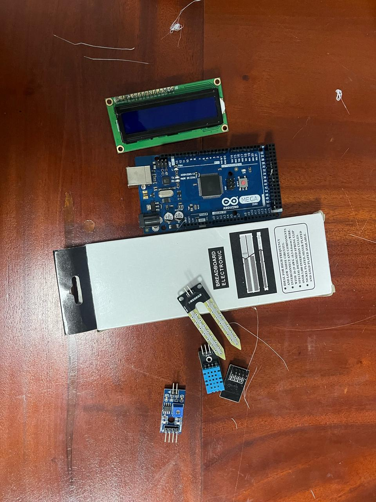
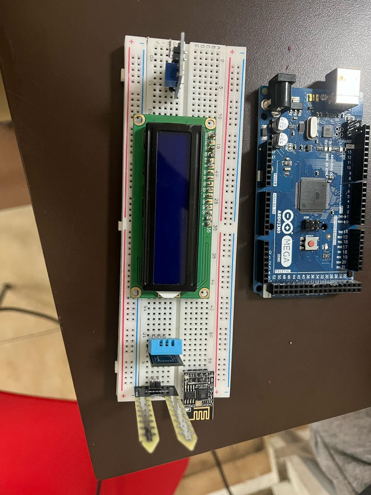
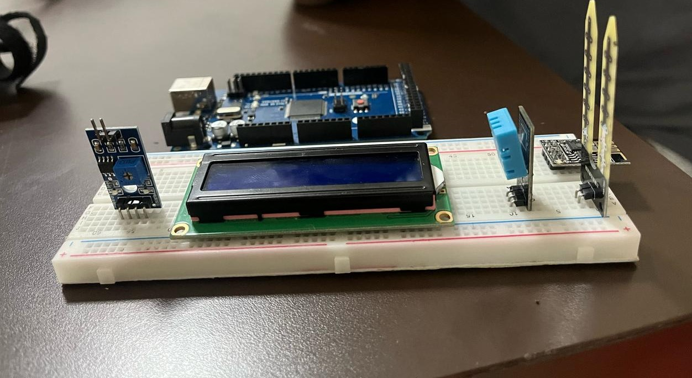

## The Weather Man – IoT-Based Smart Weather Monitoring System

    

<em align="center">Figure 1: Weather Man System Overview</em>

---

### Description

**The Weather Man** is an IoT-based smart weather monitoring system that collects, processes, and displays real-time environmental data. It uses a suite of sensors to measure temperature, humidity, soil moisture, and rainfall, transmitting data to a cloud platform for storage and analysis. The system features a web application for remote monitoring and is designed for future AI integration to provide advanced insights. Its modular hardware and software architecture make it ideal for educational, agricultural, and research applications.

---

### Team Members (Ordered by ascending Student IDs)

| Name         | Student ID  |
|--------------|-------------|
| Afra         | S/21/005    |
| Hana         | S/21/063    |
| Mundhira     | S/21/102    |
| Anshaf       | S/21/315    |
| Arani        | S/21/317    |
| Danshika     | S/21/340    |
| Premasalini  | S/21/466    |
| Romesh       | S/21/489    |
| Shahama      | S/21/490    |
| Sivothayan   | S/21/513    |

---

### Current Progress (As of April 30, 2025)

#### 🔧 Hardware Setup

| Component                        | Description                                 | Availability      |
|----------------------------------|---------------------------------------------|-------------------|
| Arduino Mega 2560                | Main controller                             | Available         |
| DHT11                            | Temperature and Humidity sensor             | Available         |
| Capacitive Soil Moisture Sensor  | Measures soil moisture                      | Available         |
| LCD Display (16x2)               | Displays weather data                       | Available         |
| ESP8266 (ESP-01)                 | Wi-Fi communication                         | Available         |
| AC to DC Converter               | Power supply                                | Available         |
| Breadboard                       | For prototyping circuits                    | Available         |
| SD Card Module                   | Logging weather data                        | Pending           |
| Raindrop Sensor Plate            | Detects rainfall                            | Pending           |
| Jumper Wires                     | For circuit connections                     | Pending           |
| Weather Station Production Case  | Enclosure for all components                | Pending           |

> **Note:**  
> - **Available**: Component is on hand  
> - **Pending**: Component ordered, awaiting delivery

---

#### 🧠 Software Progress

- Basic sensor reading code: **Complete**
- Cloud data transmission via API: **Complete**
- Database integration: **Complete**
- Web app integration: **In progress**
- SD card data logging: **Planned**
- AI integration (Claude API): **Planned**

| Feature                     | Status      | Notes                                   |
|-----------------------------|-------------|-----------------------------------------|
| Sensor Reading              | Completed   | All sensors tested and operational      |
| API Data Transmission       | Completed   | Web app integration ongoing             |
| Database Integration        | Completed   | Database setup and tested               |
| SD Card Data Logging        | Pending     | Awaiting component delivery             |
| Web App Integration         | In Progress | UI design and backend integration       |
| Documentation               | In Progress | User manual and technical documentation |
| AI Integration (Claude API) | Planned     | Research and prototyping underway       |

---

### 📂 Explore the Codebase

You can browse the project source code in the following directories:

- [API Backend](./codebase/api/) – Handles data processing and cloud integration.
- [IoT Firmware](./codebase/iot-firmware/) – Microcontroller and sensor code.
- [Web Application](./codebase/web-app/) – User interface for monitoring and analytics.

[**View Full Codebase on GitHub**](./codebase/)

---

### 📸 Project Gallery

#### Components Overview

| Scratch   | Top View   | Side View  |
|:---------:|:----------:|:----------:|
|  |  |  |

