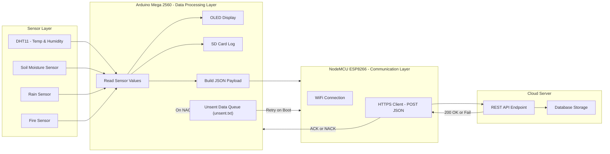

# System: Arduino Mega + NodeMCU (ESP8266) — End-to-End

**One-page summary for anyone who wants to understand or set up the whole system.**

---

## Architecture & flow (simple)

---

## Wiring musts (do not ignore)

- **Level shifter** between Mega TX1 (D18) and NodeMCU RX (D6). Mega is 5V.
- **Common ground** between Mega and NodeMCU.
- NodeMCU powered at 3.3V (USB or regulator). Do NOT power NodeMCU directly from Mega 5V pins.
- SD module CS pinned to D10 on Mega; SPI lines must be connected (MOSI=51, MISO=50, SCK=52).

---

## Timing & reliability

- Mega sends one JSON every 10 seconds.
- Mega waits up to 2 seconds for `ACK` after sending; if no ACK it queues JSON to `unsent.txt`.
- On boot Mega calls `resendUnsent()` to try queued items.
- NodeMCU posts JSON once per received line and returns `ACK`/`NACK`.

---

## How to verify whole system works

1. Power Mega and NodeMCU with proper wiring and ground.
2. Monitor NodeMCU Serial — should show WiFi connected.
3. Monitor Mega Serial — should show JSON strings and ACK/NACK lines.
4. Temporarily break WiFi (disable AP) and confirm Mega writes to `unsent.txt`.
5. Restore WiFi and reboot Mega; confirm it resends queued JSONs and `unsent.txt` shrinks or clears on success.

---

## When you need traceability / dedupe

- Current system **does not** include `local_id`. If you need to detect exactly which queued JSON was uploaded and avoid duplicates on the server, add a `local_id` to each JSON (see TODO in Mega README) and return `ACK:<local_id>` from NodeMCU.

---

## Minimal maintenance checklist

- Ensure SD card is FAT32 and fits cleanly into the module.
- Keep NodeMCU firmware libraries up to date in Arduino IDE.
- Check connections and level shifter regularly after physical handling or weather exposure.

---

## Final words — practical & honest

This code is a pragmatic, working IoT gateway for hobby and prototype deployments: it **persists data locally** (`datalog.txt` + `unsent.txt`), **retries** queued items on boot, and gives immediate feedback via `ACK`/`NACK`. It’s not hardened for large-scale production (no cert pinning, no local_id tracking, SoftwareSerial on ESP), but everything useful is already in place for a reliable small system. If you want me to add `local_id` + `ACK:<id>` handling now, I’ll give you the exact paste-in lines for both sketches and a small server JSON example.

---
